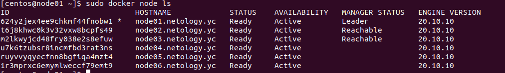
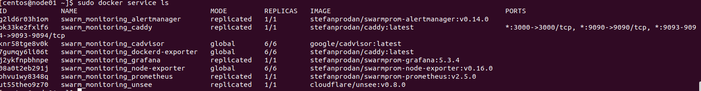
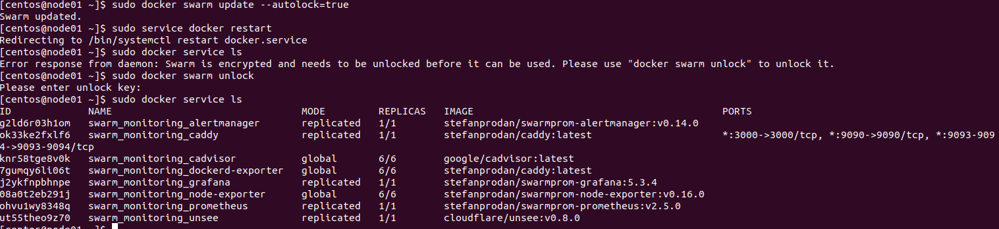

# Домашнее задание к занятию "5.5. Оркестрация кластером Docker контейнеров на примере Docker Swarm"

## Задача 1

Дайте письменые ответы на следующие вопросы:

- В чём отличие режимов работы сервисов в Docker Swarm кластере: replication и global?
  **Ответ**
  При режиме работы replication указывем какое количество реплик мы хотим запустить, в режиме global задача запускается на каждой ноде 
- Какой алгоритм выбора лидера используется в Docker Swarm кластере?
  **Ответ**
  Raft
- Что такое Overlay Network?
  **Ответ**
  Это подсеть контейнеров для обмена данными внутри класстера 

## Задача 2

Создать ваш первый Docker Swarm кластер в Яндекс.Облаке

Для получения зачета, вам необходимо предоставить скриншот из терминала (консоли), с выводом команды:
```
docker node ls
```
**Ответ**
<p align="center">
  
</p>

## Задача 3

Создать ваш первый, готовый к боевой эксплуатации кластер мониторинга, состоящий из стека микросервисов.

Для получения зачета, вам необходимо предоставить скриншот из терминала (консоли), с выводом команды:
```
docker service ls
```
**Ответ**
<p align="center">
  
</p>

## Задача 4 (*)

Выполнить на лидере Docker Swarm кластера команду (указанную ниже) и дать письменное описание её функционала, что она делает и зачем она нужна:
```
# см.документацию: https://docs.docker.com/engine/swarm/swarm_manager_locking/
docker swarm update --autolock=true
```
**Ответ**

Это команда включает блокировку Swarm Manager в запущенном кластере, запрещает манипуляции (запуск просмотр и т.д.) с докером, до разблокировки.

<p align="center">
  
</p>

