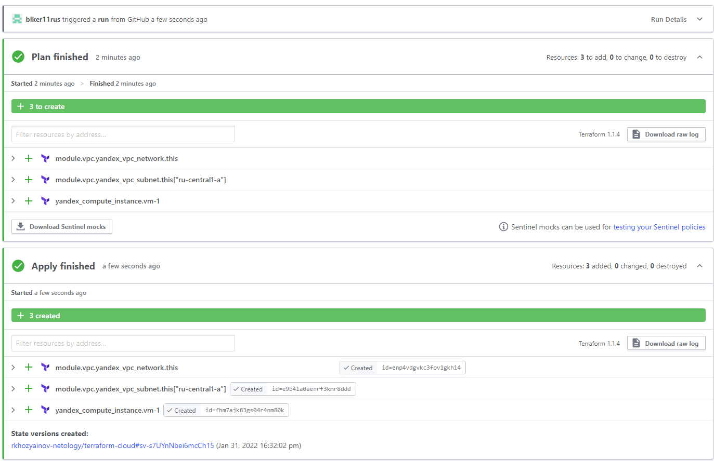

# Домашнее задание к занятию "7.4. Средства командной работы над инфраструктурой."

## Задача 1. Настроить terraform cloud (необязательно, но крайне желательно).

В это задании предлагается познакомиться со средством командой работы над инфраструктурой предоставляемым
разработчиками терраформа. 

1. Зарегистрируйтесь на [https://app.terraform.io/](https://app.terraform.io/).
(регистрация бесплатная и не требует использования платежных инструментов).
1. Создайте в своем github аккаунте (или другом хранилище репозиториев) отдельный репозиторий с
 конфигурационными файлами прошлых занятий (или воспользуйтесь любым простым конфигом).
1. Зарегистрируйте этот репозиторий в [https://app.terraform.io/](https://app.terraform.io/).
1. Выполните plan и apply. 

В качестве результата задания приложите снимок экрана с успешным применением конфигурации.

## Задача 2. Написать серверный конфиг для атлантиса. 

Смысл задания – познакомиться с документацией 
о [серверной](https://www.runatlantis.io/docs/server-side-repo-config.html) конфигурации и конфигурации уровня 
 [репозитория](https://www.runatlantis.io/docs/repo-level-atlantis-yaml.html).

Создай `server.yaml` который скажет атлантису:
1. Укажите, что атлантис должен работать только для репозиториев в вашем github (или любом другом) аккаунте.
1. На стороне клиентского конфига разрешите изменять `workflow`, то есть для каждого репозитория можно 
будет указать свои дополнительные команды. 
1. В `workflow` используемом по-умолчанию сделайте так, что бы во время планирования не происходил `lock` состояния.

Создай `atlantis.yaml` который, если поместить в корень terraform проекта, скажет атлантису:
1. Надо запускать планирование и аплай для двух воркспейсов `stage` и `prod`.
1. Необходимо включить автопланирование при изменении любых файлов `*.tf`.

В качестве результата приложите ссылку на файлы `server.yaml` и `atlantis.yaml`.

## Задача 3. Знакомство с каталогом модулей. 

1. В [каталоге модулей](https://registry.terraform.io/browse/modules) найдите официальный модуль от aws для создания
`ec2` инстансов. 
2. Изучите как устроен модуль. Задумайтесь, будете ли в своем проекте использовать этот модуль или непосредственно 
ресурс `aws_instance` без помощи модуля?
3. В рамках предпоследнего задания был создан ec2 при помощи ресурса `aws_instance`. 
Создайте аналогичный инстанс при помощи найденного модуля.   

В качестве результата задания приложите ссылку на созданный блок конфигураций. 

---

## **Ответ**

1. Скрин

<p align="center">
  
</p>

2. Ссылки на файлы

    https://github.com/biker11rus/virt-homeworks/blob/virt-11/07-terraform-04-teamwork/server.yaml

    https://github.com/biker11rus/virt-homeworks/blob/virt-11/07-terraform-04-teamwork/atlantis.yaml

3.  Модуль terraform-aws-ec2 - https://registry.terraform.io/modules/terraform-aws-modules/ec2-instance/aws/latest

    Использование модуля зависит от задач. Из минусов: не возможно использовать lifecycle

    Пример из занятия "Основы Terraform" задача 2 с использованием модуля без бекэнда и lifecycle

    ```
    provider "aws" {
    profile = "terraform"
    shared_credentials_file = "/home/rkhozyainov/.aws/credentials"
    region  = "us-west-1"
    }
    data "aws_ami" "last-ubuntu" {
    most_recent = true
    filter {
        name   = "name"
        values = ["ubuntu/images/hvm-ssd/ubuntu-focal-20.04-amd64-server-*"]
        }
    filter {
        name   = "virtualization-type"
        values = ["hvm"]
        }
    owners = ["099720109477"] # Canonical
    }
    locals {
        instance_type = {
            stage = "t2.micro"
            prod = "t2.micro"
        }
        instance_count = {
            stage = 1
            prod = 2
        }
        instances = {
            "t2.micro" = data.aws_ami.last-ubuntu.id
            "t2.micro" = data.aws_ami.last-ubuntu.id
        }
        }
    module "ec2_instance" {
        source  = "terraform-aws-modules/ec2-instance/aws"
        version = "~> 3.0"
        count = local.instance_count[terraform.workspace]
        name = "test-ubuntu"
        ami                    = data.aws_ami.last-ubuntu.id
        instance_type          = local.instance_type[terraform.workspace]
    }
    module "ec2_instance2" {
        source  = "terraform-aws-modules/ec2-instance/aws"
        version = "~> 3.0"
        for_each = local.instances
        name = "test-ubuntu-2"
        ami           = each.value
        instance_type = each.key
    }
    ```
---
